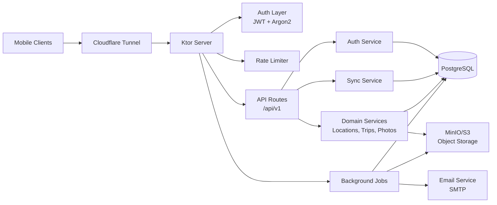
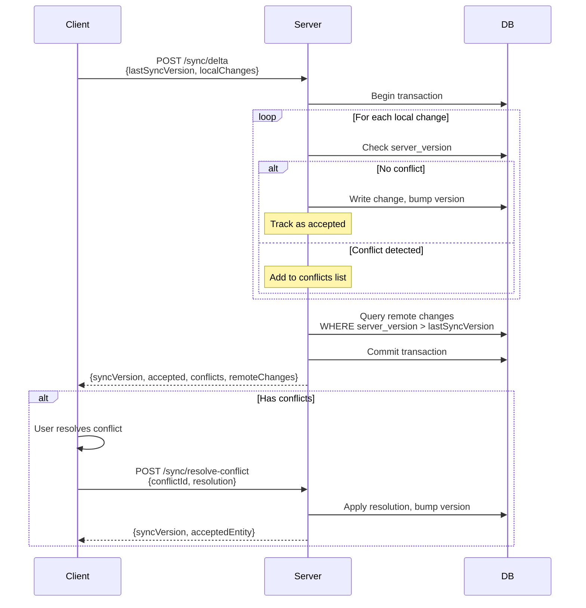
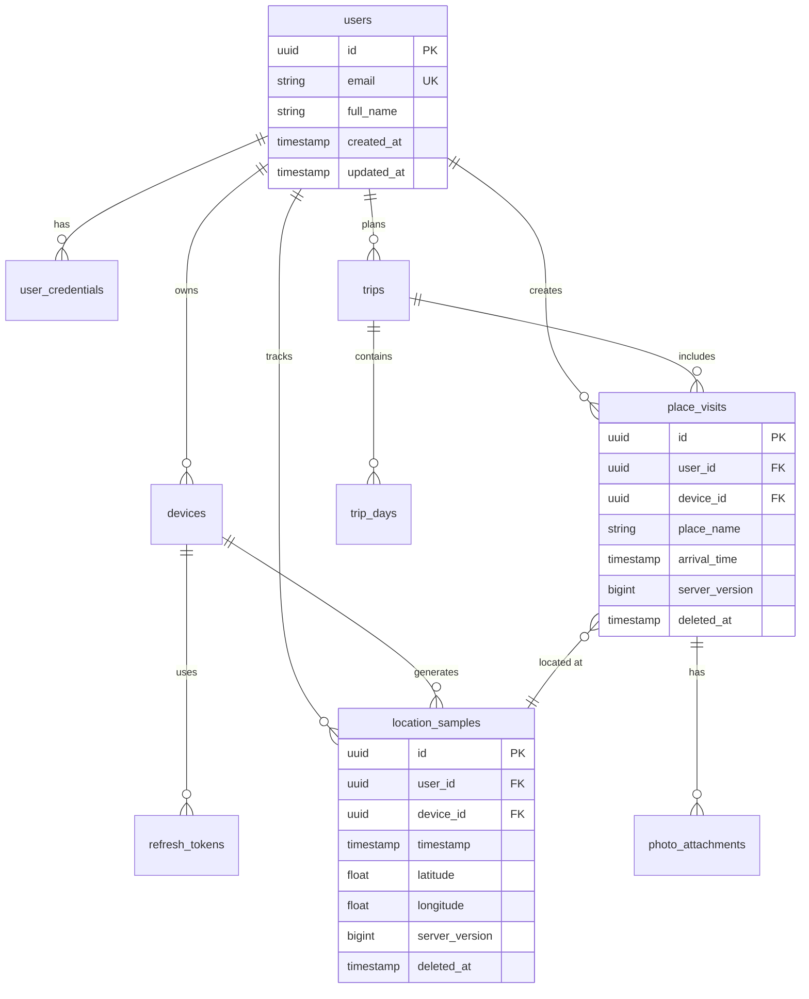

# Architecture

Backend for the Trailglass travel journal apps, optimized for self-hosted deployment with a small user base (3-5 accounts).

## System Overview

- **Ktor Server (Kotlin 2.x)** - Coroutine-first HTTP server with JWT authentication
- **Persistence** - PostgreSQL 15 with Exposed ORM and Flyway migrations
- **Object Storage** - MinIO/S3 for photos and exports (Postgres bytea fallback)
- **Background Jobs** - Coroutine-based scheduler for exports, cleanup, and email



## Modules

### HTTP Layer
- Routes at `/api/v1` with required headers (`X-Device-ID`, `X-App-Version`)
- JWT authentication with refresh tokens
- In-memory rate limiting (upgradeable to Redis)
- Uniform JSON error responses

### Auth & Identity
- Argon2id password hashing
- JWT access tokens (15 min), refresh tokens (30 days) bound to device IDs
- Tables: `users`, `user_credentials`, `devices`, `refresh_tokens`, `password_reset_tokens`

### Sync
- Per-entity `server_version` with monotonic versioning via `sync_versions` table
- `/sync/status`, `/sync/delta`, `/sync/resolve-conflict` endpoints
- Conflict detection when incoming version < stored `server_version`
- Support for encrypted payloads via `encrypted_sync_data` table



### Domain Features
- **Locations** - Batch upload, deduplication, pagination
- **Place Visits, Trips, Photos, Settings** - CRUD with conflict detection
- **Photos** - Metadata in Postgres, binary in storage with presigned URLs
- **Exports** - Async job writes ZIP to storage, poll via `/export/{id}/status`

## Data Model

- Mirror mobile SQLDelight schema with UUID keys and audit columns: `id`, `user_id`, `device_id`, `created_at`, `updated_at`, `deleted_at`, `server_version`
- Indexes on `(user_id, updated_at)` and `(user_id, server_version)` for efficient sync queries
- PostGIS optional (add later if spatial queries grow)



## Security

- HTTPS enforced via reverse proxy with `X-Forwarded-Proto` validation
- Structured logging with request IDs (avoid logging sensitive data)
- Scheduled backups for Postgres + MinIO
- Optional Cloudflare Access for admin endpoints

## Deployment

- **Local Dev**: Docker Compose with auto-migrations
- **CI**: GitHub Actions for builds, tests, and multi-arch images
- **Production**: Single host (Fly.io, Render, Raspberry Pi) with Cloudflare Tunnel for HTTPS
- **Observability**: Platform logs, optional Prometheus/Grafana metrics

```mermaid
graph TB
    subgraph Internet
        Clients[Mobile Clients]
        CF_Edge[Cloudflare Edge]
    end

    subgraph "Production Host (Raspberry Pi / VPS)"
        CF_Daemon[cloudflared<br/>Tunnel Agent]

        subgraph "Docker Compose Stack"
            Flyway[Flyway<br/>Migrations]
            App[Ktor App<br/>:8080]
            PG[(PostgreSQL<br/>:5432)]
            MinIO[MinIO<br/>:9000/:9001]

            Flyway -.->|migrate| PG
            App --> PG
            App --> MinIO
        end

        CF_Daemon --> App

        subgraph "File System"
            PG_Data[/data/postgres]
            MinIO_Data[/data/minio]
            Backups[/backups]
        end

        PG --> PG_Data
        MinIO --> MinIO_Data
    end

    Clients -->|HTTPS| CF_Edge
    CF_Edge -->|Encrypted Tunnel| CF_Daemon

    style CF_Edge fill:#f96,stroke:#333
    style CF_Daemon fill:#f96,stroke:#333
    style App fill:#9cf,stroke:#333
    style PG fill:#336791,stroke:#333,color:#fff
    style MinIO fill:#c72c48,stroke:#333,color:#fff
```

See [`SELF_HOSTING.md`](SELF_HOSTING.md) for Raspberry Pi setup and [`ENVIRONMENT_VARIABLES.md`](ENVIRONMENT_VARIABLES.md) for configuration reference.
