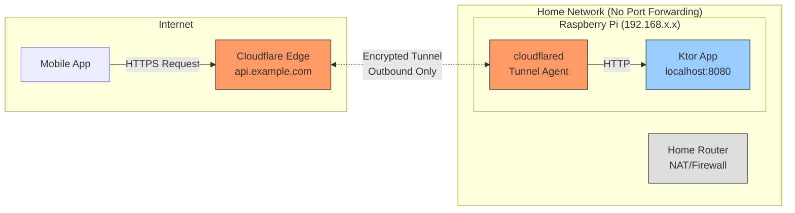

# Self-Hosting on Raspberry Pi + Cloudflare Tunnel

Run the Trailglass backend from home without a public IP by pairing a Raspberry Pi with Cloudflare Tunnel.

## 1. Hardware & OS

- Raspberry Pi 4 (4-8 GB RAM) or newer
- 64-bit OS (Raspberry Pi OS Lite or Ubuntu Server 24.04 arm64)
- USB SSD preferred over SD card for database durability

## 2. Base Setup

```bash
sudo apt update && sudo apt upgrade -y
sudo apt install -y git curl ufw docker docker-compose-plugin
```

- Create non-root deploy user, enable SSH keys, disable password auth
- Configure UFW to allow only SSH (all web traffic flows through the tunnel)

## 3. Docker Stack

Project structure:
```
/opt/trailglass-backend/
 ├── compose.yaml
 ├── env/ (app.env, db.env, minio.env)
 ├── backups/ (postgres/, minio/)
 └── data/ (postgres/, minio/)
```

Copy sample env files and secure them:
```bash
cp env/app.env.sample env/app.env
cp env/db.env.sample env/db.env
cp env/minio.env.sample env/minio.env
chmod 600 env/*.env
```

Edit the `.env` files to set secrets. The `compose.yaml` in the repo root builds an ARM-friendly image and runs Flyway migrations before the app starts.

## 4. Cloudflare Tunnel

Cloudflare Tunnel creates a secure outbound connection from your Pi to Cloudflare's edge, eliminating the need for port forwarding or exposing your home IP.



**Setup Steps:**

1. Create Cloudflare Zero Trust account and add your domain
2. Install cloudflared:
   ```bash
   curl -L https://github.com/cloudflare/cloudflared/releases/latest/download/cloudflared-linux-arm64.deb -o cloudflared.deb
   sudo dpkg -i cloudflared.deb
   ```
3. Login and create tunnel:
   ```bash
   cloudflared tunnel login
   cloudflared tunnel create trailglass-backend
   ```
4. Configure `~/.cloudflared/config.yml`:
   ```yaml
   tunnel: trailglass-backend
   credentials-file: /home/pi/.cloudflared/trailglass-backend.json
   ingress:
     - hostname: api.example.com
       service: http://localhost:8080
     - service: http_status:404
   ```
5. Install service:
   ```bash
   sudo cloudflared service install
   sudo systemctl enable --now cloudflared
   ```
6. Add DNS CNAME for `api.example.com` pointing to the tunnel in Cloudflare dashboard

## 5. TLS & Security

- Cloudflare terminates TLS; ensure `ALLOW_PLAIN_HTTP=false` in `env/app.env`
- Keep port 8080 bound to localhost (only cloudflared accesses it)
- Store secrets in `env/*.env` with `chmod 600`

## 6. Backups & Maintenance

- Use `./scripts/backup.sh` to dump Postgres and mirror MinIO buckets to `./backups`
- Use `./scripts/restore.sh` to restore from backups
- Regularly run `apt upgrade` and refresh container images
- Monitor: `df -h`, `docker compose logs -f app`
- For metrics, set `METRICS_ENABLED=true` and secure `/metrics` with Cloudflare Access

## 7. Deployment Workflow

1. Build multi-arch image: `docker buildx build --platform linux/amd64,linux/arm64 -t ghcr.io/... .`
2. Push to registry
3. On Pi: `docker compose pull && docker compose up -d`
4. Verify health:
   ```bash
   curl http://localhost:8080/health
   docker compose exec postgres pg_isready
   curl http://localhost:9000/minio/health/live
   ```

Cloudflare Tunnel provides HTTPS and DDoS protection while keeping your residential IP hidden.
