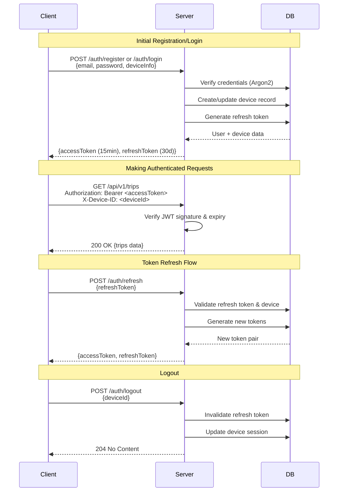

# TrailGlass Backend API Specification

**Base URL:** `https://trailglass.po4yka.com/api/v1`

**Version:** 1.0.0

**Last Updated:** 2025-11-17

## Overview

This document specifies the REST API for the TrailGlass location tracking application. The API supports:
- Multi-device synchronization with conflict resolution
- Offline-first architecture with delta sync
- Authentication and user management
- Location data, trips, photos, and settings sync

## Authentication

All API requests (except registration and login) require authentication via JWT Bearer tokens.



### Headers

```
Authorization: Bearer <jwt_token>
Content-Type: application/json
X-Device-ID: <unique_device_identifier>
X-App-Version: <app_version>
```

### Endpoints

#### POST /auth/register

Register a new user account.

**Request:**
```json
{
  "email": "user@example.com",
  "password": "securepassword123",
  "displayName": "John Doe",
  "deviceInfo": {
    "deviceId": "uuid-device-id",
    "deviceName": "John's iPhone",
    "platform": "iOS",
    "osVersion": "17.0",
    "appVersion": "1.0.0"
  }
}
```

**Response (201 Created):**
```json
{
  "userId": "user-uuid",
  "email": "user@example.com",
  "displayName": "John Doe",
  "accessToken": "jwt-access-token",
  "refreshToken": "jwt-refresh-token",
  "expiresIn": 3600,
  "createdAt": "2025-11-17T10:00:00Z"
}
```

#### POST /auth/login

Authenticate and obtain access tokens.

**Request:**
```json
{
  "email": "user@example.com",
  "password": "securepassword123",
  "deviceInfo": {
    "deviceId": "uuid-device-id",
    "deviceName": "John's iPhone",
    "platform": "iOS",
    "osVersion": "17.0",
    "appVersion": "1.0.0"
  }
}
```

**Response (200 OK):**
```json
{
  "userId": "user-uuid",
  "email": "user@example.com",
  "displayName": "John Doe",
  "accessToken": "jwt-access-token",
  "refreshToken": "jwt-refresh-token",
  "expiresIn": 3600,
  "lastSyncTimestamp": "2025-11-17T09:00:00Z"
}
```

#### POST /auth/refresh

Refresh an expired access token.

**Request:**
```json
{
  "refreshToken": "jwt-refresh-token"
}
```

**Response (200 OK):**
```json
{
  "accessToken": "new-jwt-access-token",
  "refreshToken": "new-jwt-refresh-token",
  "expiresIn": 3600
}
```

#### POST /auth/logout

Invalidate current session tokens.

**Request:**
```json
{
  "deviceId": "uuid-device-id"
}
```

**Response (204 No Content)**

---

## Sync Management

### GET /sync/status

Get current sync status and timestamps.

**Response (200 OK):**
```json
{
  "userId": "user-uuid",
  "lastSyncTimestamp": "2025-11-17T10:00:00Z",
  "syncVersion": 123,
  "deviceSyncInfo": [
    {
      "deviceId": "device-uuid-1",
      "deviceName": "John's iPhone",
      "lastSyncAt": "2025-11-17T10:00:00Z",
      "syncVersion": 123
    },
    {
      "deviceId": "device-uuid-2",
      "deviceName": "John's Android",
      "lastSyncAt": "2025-11-16T08:00:00Z",
      "syncVersion": 120
    }
  ],
  "pendingChanges": {
    "locations": 0,
    "placeVisits": 0,
    "trips": 0,
    "photos": 0
  }
}
```

### POST /sync/delta

Perform delta synchronization (upload local changes and receive remote changes).

**Request:**
```json
{
  "deviceId": "uuid-device-id",
  "lastSyncVersion": 120,
  "localChanges": {
    "locations": [
      {
        "id": "location-uuid",
        "timestamp": "2025-11-17T10:00:00Z",
        "latitude": 37.7749,
        "longitude": -122.4194,
        "altitude": 15.0,
        "accuracy": 10.0,
        "speed": 1.5,
        "bearing": 180.0,
        "provider": "GPS",
        "batteryLevel": 0.85,
        "clientTimestamp": "2025-11-17T10:00:00.123Z",
        "syncAction": "CREATE",
        "localVersion": 1,
        "deviceId": "uuid-device-id"
      }
    ],
    "placeVisits": [
      {
        "id": "visit-uuid",
        "location": {
          "latitude": 37.7749,
          "longitude": -122.4194
        },
        "placeName": "Golden Gate Park",
        "category": "OUTDOOR",
        "arrivalTime": "2025-11-17T09:00:00Z",
        "departureTime": "2025-11-17T10:30:00Z",
        "confidence": 0.95,
        "isFavorite": false,
        "notes": "Morning walk",
        "photos": ["photo-uuid-1", "photo-uuid-2"],
        "syncAction": "CREATE",
        "localVersion": 1,
        "lastModified": "2025-11-17T10:30:00Z",
        "deviceId": "uuid-device-id"
      }
    ],
    "trips": [],
    "photos": [],
    "settings": null
  }
}
```

**Response (200 OK):**
```json
{
  "syncVersion": 125,
  "syncTimestamp": "2025-11-17T10:05:00Z",
  "conflicts": [
    {
      "entityType": "PLACE_VISIT",
      "entityId": "visit-uuid",
      "conflictType": "CONCURRENT_MODIFICATION",
      "localVersion": {
        "id": "visit-uuid",
        "placeName": "Golden Gate Park",
        "lastModified": "2025-11-17T10:30:00Z",
        "deviceId": "uuid-device-id"
      },
      "remoteVersion": {
        "id": "visit-uuid",
        "placeName": "Golden Gate Park - Updated",
        "lastModified": "2025-11-17T10:32:00Z",
        "deviceId": "another-device-uuid"
      },
      "suggestedResolution": "KEEP_REMOTE"
    }
  ],
  "remoteChanges": {
    "locations": [],
    "placeVisits": [
      {
        "id": "visit-uuid-2",
        "location": {
          "latitude": 37.8044,
          "longitude": -122.2712
        },
        "placeName": "Oakland Museum",
        "category": "EDUCATION",
        "arrivalTime": "2025-11-16T14:00:00Z",
        "departureTime": "2025-11-16T16:00:00Z",
        "confidence": 0.92,
        "syncAction": "CREATE",
        "serverVersion": 124,
        "lastModified": "2025-11-16T16:00:00Z",
        "deviceId": "another-device-uuid"
      }
    ],
    "trips": [],
    "photos": [],
    "deletedIds": {
      "locations": [],
      "placeVisits": ["deleted-visit-uuid"],
      "trips": [],
      "photos": []
    }
  },
  "accepted": {
    "locations": ["location-uuid"],
    "placeVisits": [],
    "trips": [],
    "photos": []
  },
  "rejected": {
    "placeVisits": [
      {
        "id": "visit-uuid",
        "reason": "CONFLICT",
        "conflictId": "conflict-uuid"
      }
    ]
  }
}
```

### POST /sync/resolve-conflict

Resolve a sync conflict with client's chosen resolution.

**Request:**
```json
{
  "conflictId": "conflict-uuid",
  "resolution": "KEEP_LOCAL",
  "resolvedEntity": {
    "id": "visit-uuid",
    "placeName": "Golden Gate Park",
    "lastModified": "2025-11-17T10:30:00Z",
    "deviceId": "uuid-device-id"
  }
}
```

**Response (200 OK):**
```json
{
  "success": true,
  "syncVersion": 126,
  "acceptedEntity": {
    "id": "visit-uuid",
    "serverVersion": 126,
    "syncTimestamp": "2025-11-17T10:35:00Z"
  }
}
```

---

## Location Data

### POST /locations/batch

Upload location points in batch.

**Request:**
```json
{
  "locations": [
    {
      "id": "location-uuid-1",
      "timestamp": "2025-11-17T10:00:00Z",
      "latitude": 37.7749,
      "longitude": -122.4194,
      "altitude": 15.0,
      "accuracy": 10.0,
      "speed": 1.5,
      "bearing": 180.0,
      "provider": "GPS",
      "batteryLevel": 0.85
    }
  ],
  "deviceId": "uuid-device-id"
}
```

**Response (200 OK):**
```json
{
  "accepted": 150,
  "rejected": 0,
  "duplicates": 5,
  "syncVersion": 127
}
```

### GET /locations

Query location points with filters.

**Query Parameters:**
- `startTime` (ISO 8601 timestamp)
- `endTime` (ISO 8601 timestamp)
- `minAccuracy` (meters)
- `limit` (default: 1000, max: 10000)
- `offset` (default: 0)

**Response (200 OK):**
```json
{
  "locations": [
    {
      "id": "location-uuid",
      "timestamp": "2025-11-17T10:00:00Z",
      "latitude": 37.7749,
      "longitude": -122.4194,
      "altitude": 15.0,
      "accuracy": 10.0,
      "speed": 1.5,
      "bearing": 180.0,
      "provider": "GPS",
      "serverVersion": 125
    }
  ],
  "pagination": {
    "total": 5000,
    "limit": 1000,
    "offset": 0,
    "hasMore": true
  }
}
```

### DELETE /locations/:id

Delete a specific location point.

**Response (204 No Content)**

---

## Place Visits

### GET /place-visits

Get all place visits with optional filters.

**Query Parameters:**
- `startTime` (ISO 8601 timestamp)
- `endTime` (ISO 8601 timestamp)
- `category` (PlaceCategory enum)
- `isFavorite` (boolean)
- `limit` (default: 100, max: 1000)
- `offset` (default: 0)

**Response (200 OK):**
```json
{
  "placeVisits": [
    {
      "id": "visit-uuid",
      "location": {
        "latitude": 37.7749,
        "longitude": -122.4194
      },
      "placeName": "Golden Gate Park",
      "address": "Golden Gate Park, San Francisco, CA",
      "category": "OUTDOOR",
      "arrivalTime": "2025-11-17T09:00:00Z",
      "departureTime": "2025-11-17T10:30:00Z",
      "durationMinutes": 90,
      "confidence": 0.95,
      "isFavorite": false,
      "notes": "Morning walk",
      "photos": ["photo-uuid-1", "photo-uuid-2"],
      "tripId": "trip-uuid",
      "serverVersion": 124,
      "lastModified": "2025-11-17T10:30:00Z",
      "createdBy": "uuid-device-id"
    }
  ],
  "pagination": {
    "total": 250,
    "limit": 100,
    "offset": 0,
    "hasMore": true
  }
}
```

### GET /place-visits/:id

Get a specific place visit by ID.

**Response (200 OK):**
```json
{
  "id": "visit-uuid",
  "location": {
    "latitude": 37.7749,
    "longitude": -122.4194
  },
  "placeName": "Golden Gate Park",
  "address": "Golden Gate Park, San Francisco, CA",
  "category": "OUTDOOR",
  "arrivalTime": "2025-11-17T09:00:00Z",
  "departureTime": "2025-11-17T10:30:00Z",
  "durationMinutes": 90,
  "confidence": 0.95,
  "isFavorite": false,
  "notes": "Morning walk",
  "photos": ["photo-uuid-1", "photo-uuid-2"],
  "tripId": "trip-uuid",
  "serverVersion": 124,
  "lastModified": "2025-11-17T10:30:00Z",
  "createdBy": "uuid-device-id"
}
```

### POST /place-visits

Create a new place visit.

**Request:**
```json
{
  "id": "visit-uuid",
  "location": {
    "latitude": 37.7749,
    "longitude": -122.4194
  },
  "placeName": "Golden Gate Park",
  "address": "Golden Gate Park, San Francisco, CA",
  "category": "OUTDOOR",
  "arrivalTime": "2025-11-17T09:00:00Z",
  "departureTime": "2025-11-17T10:30:00Z",
  "confidence": 0.95,
  "isFavorite": false,
  "notes": "Morning walk",
  "photos": ["photo-uuid-1"]
}
```

**Response (201 Created):**
```json
{
  "id": "visit-uuid",
  "serverVersion": 128,
  "syncTimestamp": "2025-11-17T11:00:00Z"
}
```

### PUT /place-visits/:id

Update an existing place visit.

**Request:**
```json
{
  "placeName": "Golden Gate Park - Updated",
  "notes": "Morning walk with photos",
  "isFavorite": true,
  "expectedVersion": 124
}
```

**Response (200 OK):**
```json
{
  "id": "visit-uuid",
  "serverVersion": 129,
  "syncTimestamp": "2025-11-17T11:05:00Z"
}
```

**Response (409 Conflict):**
```json
{
  "error": "VERSION_CONFLICT",
  "message": "Entity was modified by another device",
  "currentVersion": 130,
  "expectedVersion": 124
}
```

### DELETE /place-visits/:id

Delete a place visit.

**Response (204 No Content)**

---

## Trips

### GET /trips

Get all trips with optional filters.

**Query Parameters:**
- `startDate` (ISO 8601 date)
- `endDate` (ISO 8601 date)
- `limit` (default: 50, max: 500)
- `offset` (default: 0)

**Response (200 OK):**
```json
{
  "trips": [
    {
      "id": "trip-uuid",
      "name": "Europe Vacation 2025",
      "startDate": "2025-06-01T00:00:00Z",
      "endDate": "2025-06-15T23:59:59Z",
      "placeVisits": ["visit-uuid-1", "visit-uuid-2"],
      "photos": ["photo-uuid-1"],
      "notes": "Two week trip across Europe",
      "totalDistance": 5000.0,
      "countries": ["France", "Italy", "Germany"],
      "serverVersion": 125,
      "lastModified": "2025-11-17T10:00:00Z",
      "createdBy": "uuid-device-id"
    }
  ],
  "pagination": {
    "total": 15,
    "limit": 50,
    "offset": 0,
    "hasMore": false
  }
}
```

### POST /trips

Create a new trip.

**Request:**
```json
{
  "id": "trip-uuid",
  "name": "Europe Vacation 2025",
  "startDate": "2025-06-01T00:00:00Z",
  "endDate": "2025-06-15T23:59:59Z",
  "notes": "Two week trip across Europe"
}
```

**Response (201 Created):**
```json
{
  "id": "trip-uuid",
  "serverVersion": 130,
  "syncTimestamp": "2025-11-17T11:10:00Z"
}
```

### PUT /trips/:id

Update a trip.

**Request:**
```json
{
  "name": "Europe Vacation 2025 - Extended",
  "endDate": "2025-06-20T23:59:59Z",
  "notes": "Extended the trip by 5 days",
  "expectedVersion": 130
}
```

**Response (200 OK):**
```json
{
  "id": "trip-uuid",
  "serverVersion": 131,
  "syncTimestamp": "2025-11-17T11:15:00Z"
}
```

### DELETE /trips/:id

Delete a trip.

**Response (204 No Content)**

---

## Photos

### POST /photos/upload

Upload a photo with metadata.

**Request (multipart/form-data):**
- `file`: Image file (JPEG, PNG, HEIC)
- `metadata`: JSON metadata

```json
{
  "id": "photo-uuid",
  "timestamp": "2025-11-17T10:00:00Z",
  "location": {
    "latitude": 37.7749,
    "longitude": -122.4194
  },
  "placeVisitId": "visit-uuid",
  "tripId": "trip-uuid",
  "caption": "Beautiful sunset at the park",
  "exifData": {
    "cameraModel": "iPhone 15 Pro",
    "focalLength": 24.0,
    "aperture": 1.8,
    "iso": 100,
    "shutterSpeed": "1/250"
  }
}
```

**Response (201 Created):**
```json
{
  "id": "photo-uuid",
  "url": "https://trailglass.po4yka.com/photos/user-uuid/photo-uuid.jpg",
  "thumbnailUrl": "https://trailglass.po4yka.com/photos/user-uuid/thumb_photo-uuid.jpg",
  "serverVersion": 132,
  "syncTimestamp": "2025-11-17T11:20:00Z"
}
```

### GET /photos/:id

Get photo metadata and URL.

**Response (200 OK):**
```json
{
  "id": "photo-uuid",
  "timestamp": "2025-11-17T10:00:00Z",
  "location": {
    "latitude": 37.7749,
    "longitude": -122.4194
  },
  "placeVisitId": "visit-uuid",
  "tripId": "trip-uuid",
  "caption": "Beautiful sunset at the park",
  "url": "https://trailglass.po4yka.com/photos/user-uuid/photo-uuid.jpg",
  "thumbnailUrl": "https://trailglass.po4yka.com/photos/user-uuid/thumb_photo-uuid.jpg",
  "exifData": {
    "cameraModel": "iPhone 15 Pro",
    "focalLength": 24.0,
    "aperture": 1.8,
    "iso": 100,
    "shutterSpeed": "1/250"
  },
  "serverVersion": 132,
  "lastModified": "2025-11-17T11:20:00Z"
}
```

### DELETE /photos/:id

Delete a photo.

**Response (204 No Content)**

---

## Settings

### GET /settings

Get user settings (synced across devices).

**Response (200 OK):**
```json
{
  "trackingPreferences": {
    "accuracy": "BALANCED",
    "updateInterval": "NORMAL",
    "batteryOptimization": true,
    "trackWhenStationary": false,
    "minimumDistance": 10
  },
  "privacySettings": {
    "dataRetentionDays": 365,
    "allowAnonymousAnalytics": true,
    "shareLocation": false,
    "requireAuthentication": true,
    "autoBackup": true
  },
  "unitPreferences": {
    "distanceUnit": "METRIC",
    "temperatureUnit": "CELSIUS",
    "timeFormat": "24_HOUR",
    "firstDayOfWeek": "MONDAY"
  },
  "appearanceSettings": {
    "theme": "AUTO",
    "accentColor": "#2196F3",
    "mapStyle": "STANDARD",
    "enableAnimations": true
  },
  "serverVersion": 5,
  "lastModified": "2025-11-17T10:00:00Z"
}
```

### PUT /settings

Update user settings.

**Request:**
```json
{
  "trackingPreferences": {
    "accuracy": "HIGH",
    "updateInterval": "FREQUENT"
  },
  "expectedVersion": 5
}
```

**Response (200 OK):**
```json
{
  "serverVersion": 6,
  "syncTimestamp": "2025-11-17T11:25:00Z"
}
```

---

## User Profile

### GET /user/profile

Get current user profile.

**Response (200 OK):**
```json
{
  "userId": "user-uuid",
  "email": "user@example.com",
  "displayName": "John Doe",
  "profilePhotoUrl": "https://trailglass.po4yka.com/avatars/user-uuid.jpg",
  "createdAt": "2025-01-01T00:00:00Z",
  "statistics": {
    "totalLocations": 50000,
    "totalPlaceVisits": 250,
    "totalTrips": 15,
    "totalPhotos": 500,
    "countriesVisited": 25,
    "totalDistance": 100000.0
  }
}
```

### PUT /user/profile

Update user profile.

**Request:**
```json
{
  "displayName": "John Smith",
  "profilePhoto": "base64-encoded-image"
}
```

**Response (200 OK):**
```json
{
  "userId": "user-uuid",
  "profilePhotoUrl": "https://trailglass.po4yka.com/avatars/user-uuid.jpg",
  "updatedAt": "2025-11-17T11:30:00Z"
}
```

### GET /user/devices

Get all registered devices.

**Response (200 OK):**
```json
{
  "devices": [
    {
      "deviceId": "device-uuid-1",
      "deviceName": "John's iPhone",
      "platform": "iOS",
      "osVersion": "17.0",
      "appVersion": "1.0.0",
      "lastSyncAt": "2025-11-17T10:00:00Z",
      "registeredAt": "2025-01-01T00:00:00Z",
      "isActive": true
    },
    {
      "deviceId": "device-uuid-2",
      "deviceName": "John's Android",
      "platform": "Android",
      "osVersion": "14.0",
      "appVersion": "1.0.0",
      "lastSyncAt": "2025-11-16T08:00:00Z",
      "registeredAt": "2025-02-01T00:00:00Z",
      "isActive": false
    }
  ]
}
```

### DELETE /user/devices/:deviceId

Unregister a device.

**Response (204 No Content)**

---

## Data Export

### POST /export/request

Request a full data export.

**Request:**
```json
{
  "format": "JSON",
  "includePhotos": true,
  "startDate": "2025-01-01T00:00:00Z",
  "endDate": "2025-12-31T23:59:59Z"
}
```

**Response (202 Accepted):**
```json
{
  "exportId": "export-uuid",
  "status": "PENDING",
  "estimatedCompletionTime": "2025-11-17T12:00:00Z"
}
```

### GET /export/:exportId/status

Check export status.

**Response (200 OK):**
```json
{
  "exportId": "export-uuid",
  "status": "COMPLETED",
  "downloadUrl": "https://trailglass.po4yka.com/exports/export-uuid.zip",
  "expiresAt": "2025-11-24T12:00:00Z",
  "fileSize": 524288000
}
```

---

## Error Responses

All error responses follow this format:

```json
{
  "error": "ERROR_CODE",
  "message": "Human-readable error message",
  "details": {
    "field": "Additional context"
  },
  "timestamp": "2025-11-17T10:00:00Z",
  "requestId": "request-uuid"
}
```

### Common Error Codes

- `UNAUTHORIZED` (401): Invalid or expired token
- `FORBIDDEN` (403): Insufficient permissions
- `NOT_FOUND` (404): Resource not found
- `VALIDATION_ERROR` (400): Invalid request data
- `VERSION_CONFLICT` (409): Concurrent modification detected
- `RATE_LIMIT_EXCEEDED` (429): Too many requests
- `INTERNAL_SERVER_ERROR` (500): Server error
- `SERVICE_UNAVAILABLE` (503): Temporary service outage

---

## Rate Limiting

- **Authentication endpoints:** 5 requests per minute
- **Sync endpoints:** 10 requests per minute
- **Location batch upload:** 100 requests per hour
- **Photo upload:** 50 requests per hour
- **Other endpoints:** 100 requests per minute

Rate limit headers:
```
X-RateLimit-Limit: 100
X-RateLimit-Remaining: 95
X-RateLimit-Reset: 1700222400
```

---

## Versioning

The API uses semantic versioning in the URL path (`/api/v1`). Breaking changes will increment the major version.

---

## Webhook Support (Future)

Future versions will support webhooks for real-time sync notifications:
- `sync.completed` - Sync operation completed
- `conflict.detected` - Conflict detected requiring resolution
- `export.ready` - Data export is ready for download

---

## Implementation Status

Backend implementation is complete. See `ARCHITECTURE.md` for system design and `ENVIRONMENT_VARIABLES.md` for configuration.
